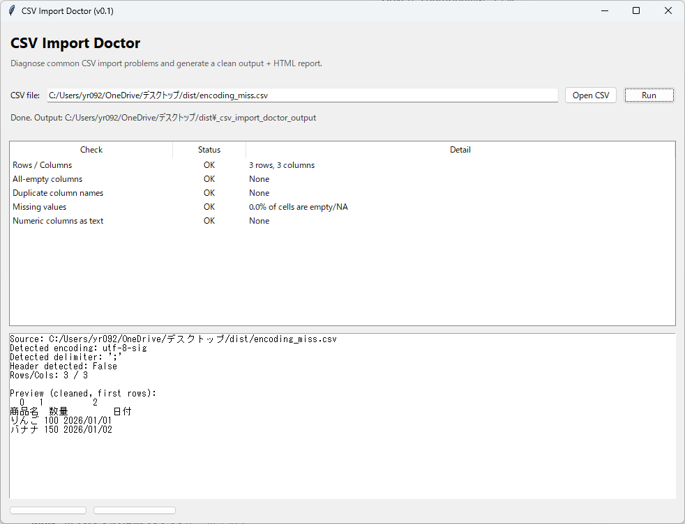

# CSV Import Doctor

Fix messy CSV files before they break your workflow.

CSV Import Doctor is a small Windows tool that helps you detect common CSV import problems **before** you load files into Excel, pandas, databases, or internal tools.

If you work with client files, web exports, or legacy CSVs, this tool helps you quickly find format issues instead of troubleshooting them by hand.

---

## What it checks

Drop in a CSV file and get:

- Encoding detection (UTF-8, Shift-JIS, etc.)
- Delimiter guessing (comma, tab, semicolon)
- Header / no-header auto-detection
- Missing data, empty columns, and numeric-as-text warnings
- A cleaned CSV file
- An HTML report with diagnostics and fix suggestions

Instead of testing encodings, delimiters, and broken rows one by one, you can quickly see what is wrong and get a cleaner CSV ready for import.

---

## Output files

For each input file, CSV Import Doctor creates:

- `yourfile_cleaned_YYYYMMDD_HHMMSS.csv`  
  Cleaned and ready for Excel or pandas.

- `yourfile_report_YYYYMMDD_HHMMSS.html`  
  A shareable diagnostics report you can send to clients or teammates.

---

## Who this is for

CSV Import Doctor is useful if you:

- Work with client or partner CSV files with mixed encodings
- Handle web exports with broken delimiters
- Receive legacy files such as Shift-JIS CSVs
- Want a quick validation step before analysis or import

---

## How it works (high level)

1. You drag & drop a CSV file onto the tool.
2. The tool inspects encoding, delimiters, headers, and row structure.
3. It flags common problems and suggests safer defaults.
4. It writes a cleaned CSV plus an HTML report next to your original file.

No Python installation is required.  
The tool runs as a Windows executable and works offline.

---

## Get the tool

The full version of CSV Import Doctor is available on Gumroad:

👉 **CSV Import Doctor on Gumroad**  
https://eternalyr.gumroad.com/l/csaukc

Buy once, use forever.

---

## Requirements

- Windows (tested on recent versions)
- Ability to run `.exe` files (no admin rights required in most cases)

---

## Follow for more tools

I build small Windows utilities for data workflows.  
Follow me on X for updates on new tools:

- X (Twitter): https://x.com/windatatools

---

## Notes

This repository provides documentation and a place to share feedback.  
If you have issues, suggestions, or ideas for new CSV tools, feel free to open an issue.
